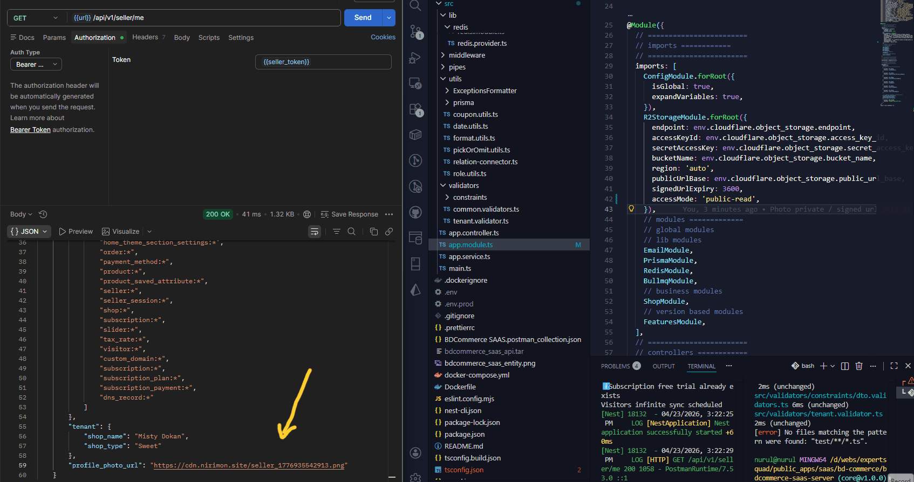

# nestjs-r2-storage

[](https://www.npmjs.com/package/nestjs-r2-storage)
[](https://opensource.org/licenses/MIT)

**Author:** Nurul Islam Rimon  
**GitHub:** [https://github.com/nurulislamrimon/nestjs-r2-storage](https://github.com/nurulislamrimon/nestjs-r2-storage)



Production-ready NestJS module for Cloudflare R2 object storage management.

## Features

- **Signed Upload URLs** - Generate presigned URLs for direct file uploads
- **Signed Download URLs** - Generate presigned URLs for secure file downloads
- **File Deletion** - Delete files from R2 storage
- **Nested Field Support** - Handle paths like `shop.logo`, `profile.avatar`
- **Array Field Support** - Handle paths like `products[].image`, `gallery[].photo`
- **Storage Usage Tracking** - Track storage used, increased, and decreased
- **Full CRUD Lifecycle** - Create, Update, Delete file operations
- **Access Control Modes** - Control public vs signed URL access (`private`, `public-read`, `hybrid`)

## Access Control Modes

Cloudflare R2 does NOT enforce ACLs like AWS S3 - the R2 API ignores ACL headers. True security is achieved by controlling URL exposure.

### Modes

| Mode          | Public URLs | Signed URLs | Use Case                              |
| ------------- | ----------- | ----------- | ------------------------------------- |
| `private`     | Not allowed | Required    | Maximum security - only signed access |
| `public-read` | Allowed     | Optional    | Public files (e.g., static assets)    |
| `hybrid`      | Allowed     | Allowed     | Mixed content (default)               |

### Private Mode

Only presigned URLs are allowed. Public URL generation throws `AccessModeError`.

```typescript
R2StorageModule.forRoot({
  // ... other options
  accessMode: "private",
  publicUrlBase: "https://cdn.example.com", // still configured but not used
});
```

Response in private mode:

```json
{
  "uploadUrl": "https://signed-url...",
  "publicUrl": null
}
```

### Public-Read Mode

Public URLs are generated. Signed URLs are optional.

```typescript
R2StorageModule.forRoot({
  // ... other options
  accessMode: "public-read",
  publicUrlBase: "https://cdn.example.com",
});
```

### Hybrid Mode (Default)

Both public and signed access are allowed for backward compatibility.

```typescript
R2StorageModule.forRoot({
  // ... other options
  accessMode: "hybrid", // default
});
```

## Quick Start

### 1. Configure the Module

```typescript
// app.module.ts
import { Module } from "@nestjs/common";
import { R2StorageModule } from "nestjs-r2-storage";

@Module({
  imports: [
    R2StorageModule.forRoot({
      endpoint: process.env.R2_ENDPOINT,
      accessKeyId: process.env.R2_ACCESS_KEY,
      secretAccessKey: process.env.R2_SECRET_KEY,
      bucketName: process.env.R2_BUCKET,
      region: "auto",
      publicUrlBase: `https://${process.env.R2_ACCOUNT_ID}.r2.cloudflarestorage.com/${process.env.R2_BUCKET}`,
      signedUrlExpiry: 3600,
    }),
  ],
})
export class AppModule {}
```

### 2. Use in Your Service

```typescript
import { Injectable } from "@nestjs/common";
import {
  PhotoManagerService,
  PhotoField,
  CloudflareService,
} from "nestjs-r2-storage";

@Injectable()
export class ProductService {
  constructor(
    private readonly photoManager: PhotoManagerService,
    private readonly cloudflare: CloudflareService,
  ) {}

  async createProduct(payload: any) {
    const photoFields: PhotoField[] = [
      { field: "image", urlField: "image_url", sizeField: "image_size" },
      {
        field: "gallery[].photo",
        urlField: "photo_url",
        sizeField: "photo_size",
      },
    ];

    const result = await this.photoManager.createObjectWithPhotos(
      payload,
      photoFields,
    );

    // Return upload URLs to client for direct upload
    return {
      product: result.updatedPayload,
      uploadUrls: result.uploadUrls,
      totalStorageUsed: result.totalStorageUsed,
    };
  }

  async getProduct(id: string) {
    const product = await this.findProduct(id);

    const photoFields: PhotoField[] = [
      { field: "image", urlField: "image_url" },
      { field: "gallery[].photo", urlField: "photo_url" },
    ];

    return this.photoManager.appendPhotoUrls(product, photoFields);
  }

  async updateProduct(id: string, payload: any) {
    const existing = await this.findProduct(id);

    const photoFields: PhotoField[] = [
      { field: "image", urlField: "image_url", sizeField: "image_size" },
    ];

    const result = await this.photoManager.updateObjectWithPhotos(
      payload,
      existing,
      photoFields,
    );

    return {
      product: result.updatedPayload,
      uploadUrls: result.uploadUrls,
      storageIncrease: result.storageIncrease,
      storageDecrease: result.storageDecrease,
    };
  }

  async deleteProduct(id: string) {
    const product = await this.findProduct(id);

    const photoFields: PhotoField[] = [
      { field: "image", urlField: "image_url" },
    ];

    await this.photoManager.deletePhotosFromObject(product, photoFields);
    await this.removeProduct(id);
  }
}
```

## API Reference

### CloudflareService

Direct R2 operations.

```typescript
// Generate upload URL
const uploadUrl = await cloudflare.getUploadUrl("avatar.png", 1024000);

// Generate download URL
const downloadUrl = await cloudflare.getDownloadUrl("uploads/avatar_123.png");

// Delete file
await cloudflare.deleteFile("uploads/avatar.png");

// Check if file exists
const exists = await cloudflare.fileExists("uploads/avatar.png");
```

### Presigned URL Security

The module uses secure presigned URL generation:

- **Content-Length is NOT signed** - Prevents `SignatureDoesNotMatch` errors (browsers calculate it differently)
- **Checksum headers disabled** - Uses `requestChecksumCalculation: "WHEN_REQUIRED"` to avoid R2 compatibility issues
- **Minimal signing** - Only signs `host` and `content-type` headers

```typescript
const result = await cloudflare.getUploadUrl("avatar.png", 1024000);

// result = {
//   uploadUrl: "https://signed-url...",
//   fileKey: "uploads/avatar_123.png",
//   publicUrl: "https://cdn.example.com/uploads/avatar_123.png",
//   mimeType: "image/png",
//   sizeField: 1024000  // Use this for client-side validation before upload
// }
```

### PhotoManagerService

High-level photo management.

#### appendPhotoUrls()

Adds signed URLs to response objects.

```typescript
const photoFields: PhotoField[] = [
  { field: "avatar", urlField: "avatar_url" },
  { field: "shop.logo", urlField: "logo_url" },
  { field: "products[].image", urlField: "image_url" },
  { field: "gallery[].photo", urlField: "photo_url" },
];

const result = await photoManager.appendPhotoUrls(product, photoFields);
```

Input:

```json
{
  "name": "Laptop",
  "image": "laptop.png",
  "gallery": [{ "photo": "photo1.jpg" }, { "photo": "photo2.jpg" }]
}
```

Output:

```json
{
  "name": "Laptop",
  "image": "laptop.png",
  "image_url": "https://signed-url...",
  "gallery": [
    { "photo": "photo1.jpg", "photo_url": "https://signed-url..." },
    { "photo": "photo2.jpg", "photo_url": "https://signed-url..." }
  ]
}
```

#### createObjectWithPhotos()

Creates object with photo upload URLs.

```typescript
const payload = {
  name: "Laptop",
  image: "laptop.png",
  image_size: 42000,
  gallery: [
    { photo: "photo1.jpg", photo_size: 10000 },
    { photo: "photo2.jpg", photo_size: 15000 },
  ],
};

const photoFields: PhotoField[] = [
  { field: "image", sizeField: "image_size" },
  { field: "gallery[].photo", sizeField: "gallery[].photo_size" },
];

const result = await photoManager.createObjectWithPhotos(payload, photoFields);

// result = {
//   updatedPayload: { ...with generated file keys... },
//   uploadUrls: [{ field, fileKey, uploadUrl, publicUrl }],
//   totalStorageUsed: 67000
// }
```

#### updateObjectWithPhotos()

Updates object with new photos, deletes old files.

```typescript
const result = await photoManager.updateObjectWithPhotos(
  newPayload,
  existingObject,
  photoFields,
);

// result = {
//   updatedPayload: { ... },
//   uploadUrls: [{ field, fileKey, uploadUrl, publicUrl }],
//   storageIncrease: 1000,
//   storageDecrease: 500,
//   deletedFiles: ['old-file.png']
// }
```

#### deletePhotosFromObject()

Deletes all photos from object.

```typescript
const result = await photoManager.deletePhotosFromObject(product, photoFields);

// result = {
//   deletedFiles: ['file1.png', 'file2.jpg'],
//   totalStorageFreed: 25000
// }
```

## Field Path Syntax

### Simple Nested Fields

```
shop.logo
profile.avatar
user.profile.image
```

### Array Fields

```
gallery[].photo        -> gallery[0].photo, gallery[1].photo, ...
products[].image      -> products[0].image, products[1].image, ...
variants[].images[]   -> variants[0].images[0], variants[0].images[1], ...
```

### Supported Patterns

| Path                       | Description                     |
| -------------------------- | ------------------------------- |
| `shop.logo`                | Simple nested field             |
| `user.profile.image`       | Deeply nested with dots         |
| `gallery[].photo`          | Array of objects                |
| `products[].images[]`      | Array containing array          |
| `variants[0].images[].url` | Indexed array with nested array |

## Configuration Options

| Option            | Type   | Required | Description                                                         |
| ----------------- | ------ | -------- | ------------------------------------------------------------------- |
| `endpoint`        | string | Yes      | R2 endpoint URL                                                     |
| `accessKeyId`     | string | Yes      | R2 access key ID                                                    |
| `secretAccessKey` | string | Yes      | R2 secret access key                                                |
| `bucketName`      | string | Yes      | R2 bucket name                                                      |
| `region`          | string | No       | AWS region (default: 'auto')                                        |
| `publicUrlBase`   | string | No       | Base URL for public access                                          |
| `signedUrlExpiry` | number | No       | Signed URL expiry in seconds (default: 3600)                        |
| `accessMode`      | string | No       | Access mode: `private`, `public-read`, `hybrid` (default: `hybrid`) |

## Error Handling

### AccessModeError

Thrown when attempting to generate public URLs in `private` access mode.

```typescript
import { AccessModeError } from "nestjs-r2-storage";

try {
  const result = await cloudflare.getUploadUrl("file.png", 1024);
} catch (error) {
  if (error instanceof AccessModeError) {
    console.log(error.message); // "Public URL generation is not allowed in 'private' access mode..."
  }
}
```

## Async Configuration

```typescript
R2StorageModule.forRootAsync({
  useFactory: () => ({
    endpoint: process.env.R2_ENDPOINT,
    accessKeyId: process.env.R2_ACCESS_KEY,
    secretAccessKey: process.env.R2_SECRET_KEY,
    bucketName: process.env.R2_BUCKET,
  }),
});
```

## Changelog

### v1.2.6 (2025-04-20)

- Refactored getNestedValue: access key first, then handle array segments
- Refactored setNestedValue: proper handling of empty brackets [] and indexed arrays [0]
- Robust parsing of paths: user.profile.image, gallery[].photo, variants[0].images[].url

### v1.2.5 (2025-04-20)

- Rewrote parseFieldPath to split by dot then parse each segment (fixes regex state bugs)
- Fixed getNestedValue array traversal when next key is a property (not array/index)
- Fixed setNestedValue for empty array brackets `[]` and indexed arrays `[0]`
- Added null/undefined guards throughout
- Supports: `gallery[].photo`, `variants[].images[].url`, `a[].b[0].c`

### v1.2.4 (2025-04-20)

- Fixed parseFieldPath regex to handle keys containing dots
- Fixed parseFieldPath empty bracket handling (`[]` now correctly returns `undefined` for arrayIndex)
- Fixed getNestedValue array traversal for paths like `variants[].photo`
- Added null/undefined guards in array field processing methods
- Improved safety for deeply nested array structures

### v1.2.3 (2025-04-13)

- Added AccessModeError for private mode public URL generation

## License

MIT
